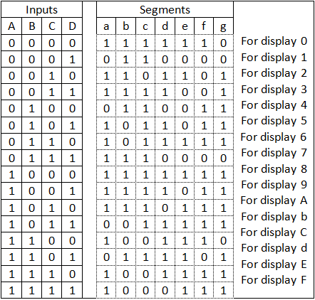

# Chisel 7 Segment

In this simple project, we will learn how combinational circuits can be expressed in Chisel3.

## Building on macOS
1. SBT can be installed via Homebrew :
   <code>$ brew install sbt</code>
2. Clone the repository.

3. <code>$ make seven-segment</code> will: 
* generate the hardware.

4. <code>$ make seven-segment-test</code> will: 
*  test the circuit.

### Truth Table 

 
